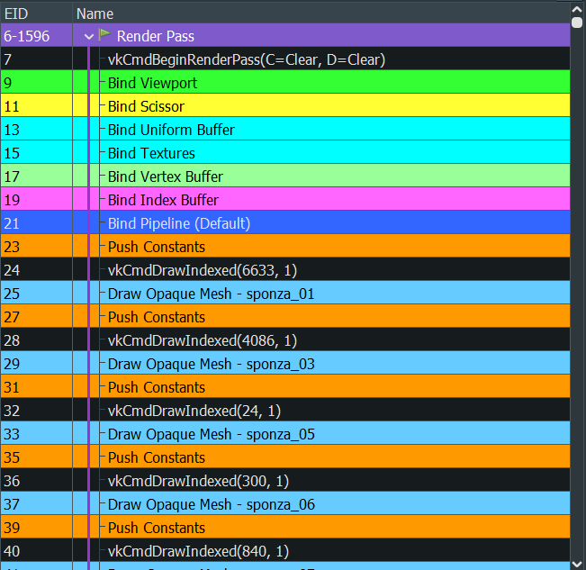

# 🌋 Pompeii

**Pompeii** is a Vulkan-based Graphics Renderer written in C++.
Pompeii is a learning project to explore the Vulkan API
during the Graphics Programming 2 course at Howest University - Digital Arts & Entertainment

---

## 🌟 Features

### Vulkan Abstraction

I abstracted the Vulkan API, making classes (and builders) for most Vulkan Objects, such as:

- VkInstance
- VkCommandPool
- VkBuffer
- VkSwapchainKHR
- VkPipeline
- ...

### Rendering Opaque & Transparent Meshes

Two Vulkan pipelines have been set up: one for rendering opaque meshes and another for rendering transparent meshes.

When rendering a model or scene:

1. The vertex and index buffers are bound.
2. The opaque pipeline is bound, and all opaque meshes are drawn.
3. After rendering the opaque meshes, the transparent pipeline is bound, and the transparent meshes are drawn.

### Texture Array in Shaders

As of right now there are 2 shaders: "shader.vert" and "shader.frag". The fragment shader needs the model textures
to be able to sample from them. For this, I created an array in the fragment shader that holds all the textures of a model. Each mesh
can then index that array through an index they get via push constants. This way, the descriptor set for the textures only needs to be bound 
once per model, instead of once per mesh.

The size of the array in the shader is not hard coded to some big vlaue, but gets set to the number of textures a model has, using Shader Specializations

### Mipmaps

When a model loads in textures/images, it will also generate mipmaps for said images.
It will always try to generate as many mipmaps as it can (and the sampler will use them all).
Unless the texture is smaller than a certa

Mipmaps are great!
If an object is further away, the sampler will sample fromm is lower resolution texture, removing aliasing artifacts from distant objects.

Ideally, mipmaps don't get generated at runtime, but are generated beforehand. This is currently not the case.

### Multi-Sampling (MSAA)

MSAA (Multi-Sampling Anti-Aliasing) is turned on. The number of samples is set to the maximum your device can do.
Which probably isn't always what you want, but it's what you get for now.

Since MSAA only smoothens the edges of the geometry and not the interior filling, Sample Shading is also enabled.
Sample Shading will run the fragment shader per sampler, instead of per pixel/fragment, improving image quality. This obviously comes at a performance cost.

### Debug Help

#### Debug Labels & Names

Allow setting Debug Labels or Object Names to help with debugging.

The labels allow you to mark region within a command buffer, which in turn get visualized in debug programs such as RenderDoc or NVIDIA NSight.
 Likewise with Object Names. Validation Layers and Debug Programs such as mentioned before will use these object names, which improves clarity and greatly helps when debugging.

#### Benchmarking

The static Timer class allows you to easily benchmark operations and see how long they take. This can help finding potentional bottlenecks in the program.

---

## 🎮 Controls

### Movement
- **W**: Move forward
- **A**: Move left
- **S**: Move backward
- **D**: Move right
- **E**: Move (world) up
- **Q**: Move (world) down

### Look Around
- **LMB + DRAG**: Look around

### Window
- **F11**: Toggle Fullscreen
- **ESC**: Exit Fullscreen

---

## 📸 Screenshots

Sponza Scene with Transparent Objects (no mipmapping):

Sponza Scene Hallway (mipmapping):

---

## 📁 Folder Structure

<pre>
Pompeii/ 
├── cmake/			# CMake Scripts.
├── images/			# images for the README.md, such as screenshots.
└── project/			# project code and assets.
	├── models/
	├── shaders/
	├── src/		# source code.
	├── textures/
	└── CmakeLists.txt	# Build configuration project.
├── .gitattributes		
├── .gitignore			
├── CMakeLists.txt		# Build configuration global.
├── CMakeSettings.json
├── LICENSE.txt
└── README.md			# ⭕ You are here :)
</pre>

---

## 🙏 Resources

Graphics Programming Teachers at Howest University - Digital Arts & Entertainment  
The Vulkan Tutorial at [vulkan-tutorial.com](https://vulkan-tutorial.com)  

---

## 📚 Third-Party Libraries

This project uses the following third-party libraries:

### Vulkan

| Library                                | Purpose          |
|----------------------------------------|------------------|
| [Vulkan API](https://vulkan.lunarg.com) | Vulkan |
| [Vulkan Memory Allocator (VMA)](https://github.com/GPUOpen-LibrariesAndSDKs/VulkanMemoryAllocator.git) | Vulkan Memory |

### Other

| Library                                | Purpose          |
|----------------------------------------|------------------|
| [GLFW](https://github.com/glfw/glfw.git) | Window & Input |
| [glm](https://github.com/g-truc/glm.git) | Math Library |
| [stb](https://github.com/nothings/stb.git) | Texture Loading |
| [Open Asset Import Library (Assimp)](https://github.com/assimp/assimp.git) | Model Loading |
